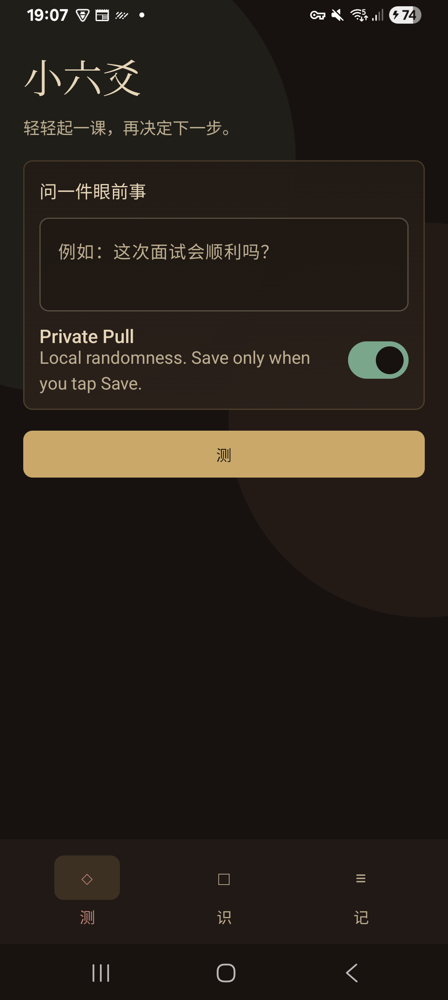
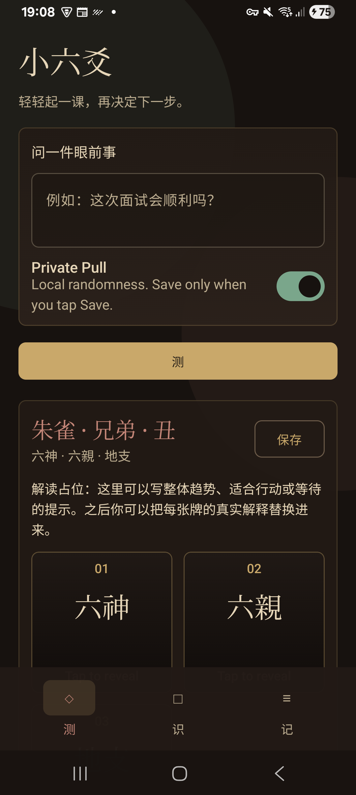
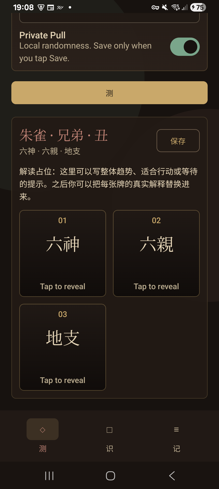
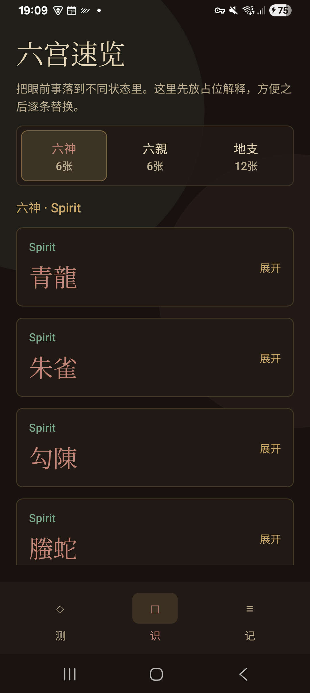
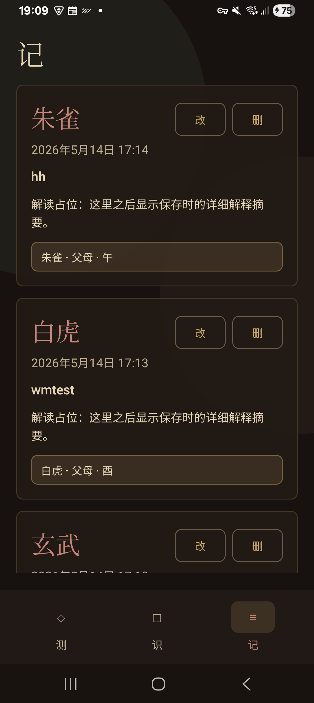

# Little LiuYao Android

Little LiuYao is a small Android app for making a simple 小六爻-style card pull.

The app lets you:

- Type an intention or question.
- Pull one card from each of three decks: 六神, 六親, and 地支.
- Keep the pull private on the device by default.
- Reveal cards with a flip animation.
- Save pulls to local records and edit or delete saved intentions.
- Browse a basic knowledge/reference view for the cards.

The app is written in Kotlin with Jetpack Compose and builds with Gradle.

## Screenshots

  
  
  
  
  

## Notes

- Minimum Android version: Android 8.0, API 26.
- Target SDK: 36.
- Records are saved locally with Android `SharedPreferences`.
- The app has internet permission only for the optional connected pull feature.
